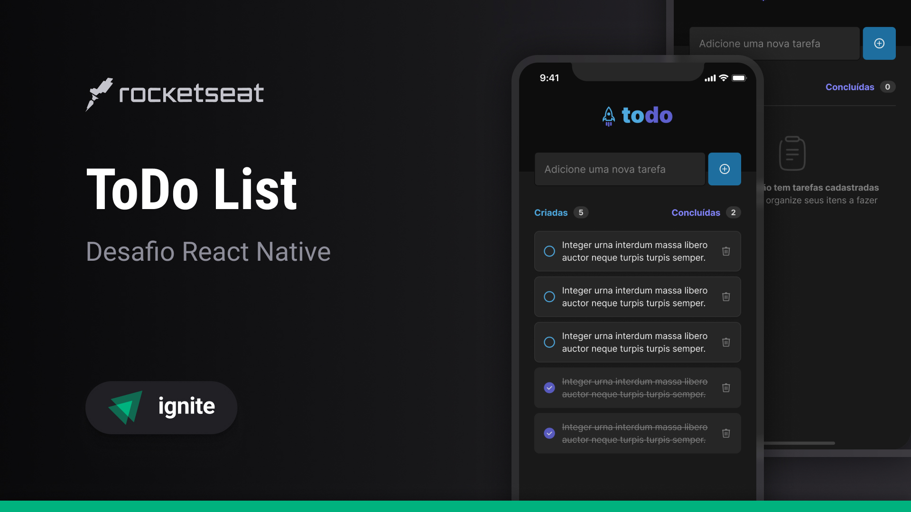

# Desafio: To-Do List com React Native
Este é um pequeno desafio proposto pela Rocketseat, no qual tive a oportunidade de explorar minha criatividade e minhas habilidades soft skills para criar um aplicativo de lista de tarefas (To-Do List) utilizando React Native.

## 👨🏽‍💻 Stack

- [x] ReactNative
- [x] Typescript 

## Figma do projeto
Você pode visualizar o layout deste projeto através [desse link](https://www.figma.com/file/bTAYGsMHkmwJh9Lij27LFV/ToDo-List-%E2%80%A2-Desafio-React-Native-Copy?fuid=1029408669370399966).
Lembrando que é necessário ter uma conta no [Figma](http://figma.com/) para poder acessar.
## Libs usadas

- [x] Phosphor React (Para Icones)
- [x] ExpoCheckbox  

## Tarefas Pendentes 

- [x] Adicionar função para criar nova nova tarefa
- [x] Adicionar função para deletar uma tarefa
- [x] Adicionar função para contar quantas tarefas foram concluidas 
- [x] Adicionar função para contar quantas tarefas foram criadas 
- [x] Adcionar função para marcar tarefa como concluída e riscar a tarefa 
## Executando o projeto

Faça o clone deste projeto em seu computador e depois execute com npm:

para rodar o projeto
```bash 
cd to-do-list
npm install
npx expo start
```
## Você pode baixar o app e testar em seu dispositivo Android
<a href="https://expo.dev/artifacts/eas/ub6vVUhPaTF11DQBfUTCsg.apk">Link para download